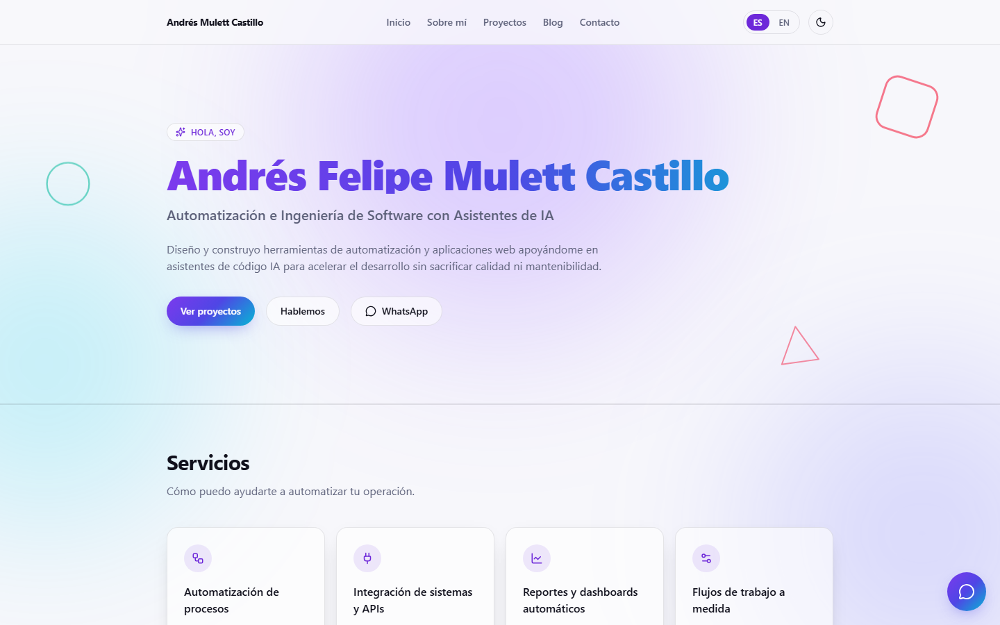
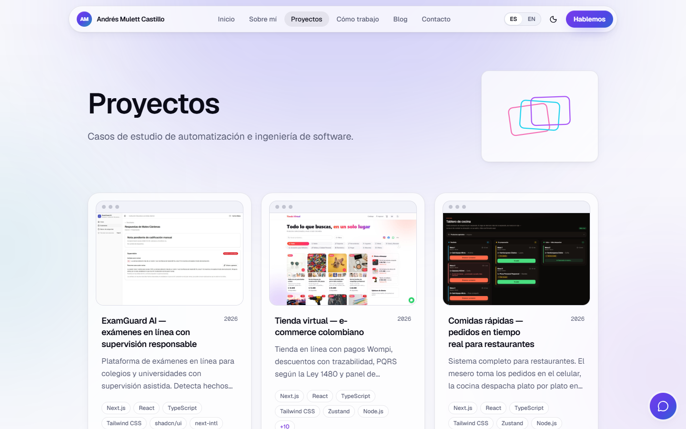
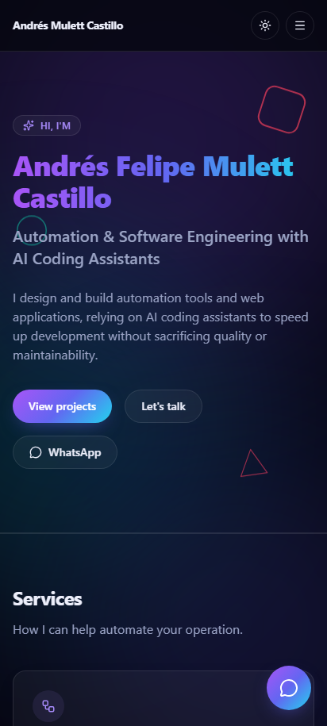

# Portafolio web — Andrés Felipe Mulett Castillo

[](https://github.com/mulettcastillo2018/portafolio-web/actions/workflows/ci.yml)

Portafolio profesional construido con Next.js (App Router) + TypeScript + Tailwind CSS, con soporte bilingüe (ES/EN), blog en Markdown y formulario de contacto.

**Sitio publicado:** [mulett.vercel.app](https://mulett.vercel.app)



<table>
  <tr>
    <td align="center"><br><sub>Casos de estudio</sub></td>
    <td align="center"><br><sub>Inglés · modo oscuro · celular</sub></td>
  </tr>
</table>

## Qué incluye

- Rutas por idioma (`/es`, `/en`) con next-intl y selector de idioma.
- Casos de estudio y blog escritos en Markdown, editables también desde un panel de contenido (Decap CMS) sin tocar código.
- Secciones de servicios, proceso, precios, tecnologías y preguntas frecuentes.
- Formulario de contacto con Resend y botón de WhatsApp.
- Modo claro y oscuro, sitemap y robots para buscadores; el panel de administración queda fuera de producción y de los buscadores.

## Cómo se construyó con IA

Este sitio, como los proyectos que muestra ([tienda-virtual](https://github.com/mulettcastillo2018/tienda-virtual) y [comidas-rapidas](https://github.com/mulettcastillo2018/comidas-rapidas)), se construyó **dirigiendo un agente de IA (Claude Code)**:

- **Yo** definí el contenido, las secciones y el tono, y revisé cada entrega pidiendo los ajustes necesarios.
- **El agente** escribió el código, la configuración bilingüe, el panel de contenido y la documentación técnica ([docs/ARQUITECTURA.md](docs/ARQUITECTURA.md)).
- Se hizo en 5 commits entre el 23 y el 27 de septiembre de 2026, en un equipo corporativo con proxy: por eso el proyecto no incluye ESLint (ver la nota más abajo).

## Correr en local

```bash
npm install
npm run dev
```

Abre [http://localhost:3000](http://localhost:3000) (redirige automáticamente a `/es`).

> Nota: este proyecto **no incluye ESLint** por ahora — se quitó temporalmente porque algunas de sus dependencias eran bloqueadas por un proxy corporativo durante el desarrollo. Se puede volver a agregar con `npm install -D eslint eslint-config-next` cuando ya no sea un problema.

## Documentación técnica

Cómo funciona todo por dentro (i18n, contenido, componentes, el panel de admin, etc.) está en [`docs/ARQUITECTURA.md`](docs/ARQUITECTURA.md).

## Estructura del proyecto

```
content/
  projects/es/*.md    ← un caso de estudio por proyecto en español (frontmatter: title, summary, stack, role, year, featured, order, links)
  projects/en/*.md    ← la versión en inglés de cada caso (mismo nombre de archivo)
  settings/*-{es,en}.json ← servicios, tecnologías, "Cómo trabajo con IA", precios y FAQ
  blog/es/*.md         ← posts del blog en español
  blog/en/*.md         ← posts del blog en inglés
messages/
  es.json, en.json     ← todos los textos de la interfaz (nav, hero, skills, formularios, etc.)
src/
  app/[locale]/        ← todas las páginas (home, about, projects, how-i-work, blog, contact)
  app/api/contact/     ← endpoint del formulario de contacto
  components/          ← ui/, layout/, sections/, projects/, blog/, contact/
  lib/content.ts       ← lectura y parseo de los archivos Markdown
  i18n/                ← configuración de next-intl (rutas /es y /en)
```

## Editar contenido

- **Proyectos**: un archivo por idioma en `content/projects/es/` y `content/projects/en/`, con el mismo nombre. Si falta la versión en inglés, el sitio muestra la española.
- **Cómo trabajo con IA** (`/how-i-work`): el contenido está en `content/settings/aiworkflow-es.json` y `aiworkflow-en.json`; los títulos de la página, en `messages/*.json` (`howIWork`).
- **Blog**: agrega archivos `.md` en `content/blog/es/` y `content/blog/en/` (mismo `slug`/nombre de archivo en ambos si quieres el post en los dos idiomas).
- **Textos de la interfaz** (hero, "sobre mí", footer, etc.): edita `messages/es.json` y `messages/en.json`.
- **Redes sociales**: agrega tus enlaces de GitHub/LinkedIn en `src/components/layout/Footer.tsx` (hay un comentario `TODO` marcando dónde).
- **Foto de "Sobre mí"**: coloca tu foto como `public/images/profile.jpg` (recomendado: orientación vertical, cuerpo completo). Mientras no exista ese archivo, la página muestra automáticamente una ilustración de código como reemplazo — en cuanto agregues el archivo con ese nombre exacto, se usa tu foto sin tocar código.

## Formulario de contacto

El endpoint `src/app/api/contact/route.ts` usa [Resend](https://resend.com) para enviar los mensajes por correo. Sin las variables de entorno configuradas, el formulario responde con un error controlado y muestra el email de contacto como alternativa (no rompe la build).

1. Crea una cuenta gratuita en [resend.com](https://resend.com) y genera un API key.
2. Copia `.env.example` a `.env.local` y completa:
   ```
   RESEND_API_KEY=tu_api_key
   CONTACT_TO_EMAIL=mulettcastillo2013@gmail.com
   ```

## Seguridad y calidad

- **Cabeceras de seguridad** (`next.config.ts`): política de contenido (CSP) que solo permite recursos del propio sitio, protección contra incrustar el sitio en otras páginas, `nosniff`, HSTS y permisos del navegador desactivados. La CSP solo se aplica en producción porque el servidor de desarrollo necesita `eval` y websockets.
- **Formulario de contacto contra spam** (`src/app/api/contact/route.ts`): campo trampa invisible, tiempo mínimo de llenado (3 s), máximo 5 envíos por IP cada 10 minutos y tamaño máximo de la petición. A los bots se les responde "ok" sin enviar nada. El límite por IP vive en la memoria de cada instancia: es una barrera contra ráfagas, no un contador global.
- **Vista previa en redes y SEO**: cada página declara su URL canónica y sus versiones por idioma (`hreflang`), y hay imágenes para redes generadas en el build (`opengraph-image.tsx`) para el sitio, cada caso de estudio y "Cómo trabajo con IA". Usan la fuente Geist (licencia OFL, en `src/assets/fonts/`).
- **Integración continua** (`.github/workflows/ci.yml`): en cada push se revisa que el contenido esté completo en los dos idiomas (`npm run check:content`), los tipos y el build de producción.

## Desplegar en Vercel

1. En [vercel.com](https://vercel.com), importa el repositorio `mulettcastillo2018/portafolio-web` (rama `master`).
2. Configura las variables de entorno en el proyecto de Vercel:
   - `NEXT_PUBLIC_SITE_URL` (opcional): la URL pública, por ejemplo `https://tu-proyecto.vercel.app`. Si no se define, se usa el dominio de producción que Vercel entrega al compilar (`VERCEL_PROJECT_PRODUCTION_URL`, el más corto del proyecto); fuera de Vercel, sin ella el sitemap, robots.txt, las URLs canónicas y las imágenes para redes apuntarían a `localhost`. Se fija al compilar: si la cambias, vuelve a desplegar.
   - `RESEND_API_KEY` y `CONTACT_TO_EMAIL`: para que el formulario envíe correos. Con el remitente de pruebas de Resend (`onboarding@resend.dev`), los correos solo llegan al email con el que creaste la cuenta de Resend; para otro destino hay que verificar un dominio propio.
3. Cada push a `master` despliega automáticamente.
